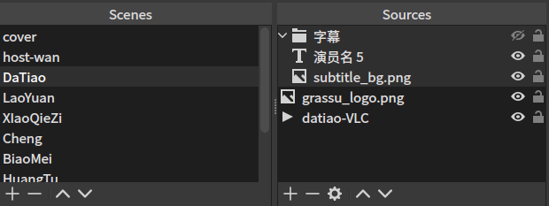

# 主办方指南

## 技术部署
### 流媒体服务器搭建
主办方需要有一台服务器接收表演者推送进来的流媒体，为了保证质量可以考虑采购云主机，测试发现大概需要10-20Mbps的出站带宽即可达到比较顺畅的720p质量的流。理论上家庭宽带和普通电脑大致上也可以承担此任务，但实际可能会因为线路问题导致部分乐手信号卡顿或掉线。这里以一台最基本配置的Linux云主机服务器为例，介绍搭建方法。

首先安装Nginx服务和RTMP协议组建：

```
sudo apt install nginx-full libnginx-mod-rtmp
```

然后编辑配置文件：

```
sudo nano /etc/nginx/nginx.conf
```

翻到最下方，添加以下内容：

```
rtmp {
        server {
                listen 1935;

                application live {
                        live on;
                        record off;
                }
        }
}
```

按 *Ctrl+X* 选择*Y* 保存退出。然后启动Nginx服务：

```
sudo service nginx start
```

此时RTMP服务器已经开始运行，为了使互联网上任何用户都可以连接到你的服务器，需要在云服务商的防火墙设置界面（如有）打开 *1935* 端口，然后查询你的服务器公网IP地址，那么RTMP的推流地址应该为：

> rtmp://[服务器IP地址]/live/[为表演者分配的密钥字符串]

其中 *为表演者分配的密钥字符串* 可以为任意字符串，需要为每一位表演者分配不同的字符串，以防互相混淆错乱。并且，表演者的推流地址同时也是下一步中你在导播台读取该流媒体的地址。确认好地址后，将其公布给参与活动的表演者，并尽量鼓励其进行一次排练测试。

### 导播软件安装配置
导播软件首选在电脑上使用[OBS Studio](https://obsproject.com/download)，详细的配置和使用方法在官网有文档和教程，这里介绍基本的配置。

打开OBS软件，第一次会弹出配置向导，主要需要选择的是：优先推流而非录制、画像尺寸（本例中为1280*720）、帧率（本例为30fps）、推流地址。其中推流地址可以暂时随便选择，之后会讲解如何填写。

进入主界面后，左下角有两个部分：Scenes和Sources，其中Scenes即每一个需要切换的画面，例如可以是主持人或某个乐手，甚至是乐手和主持人画中画的堆叠同时出现。而Sources则属于一个Scene下面的需要显示或播放的媒体来源，比如某个场景中你需要乐手的画面和声音、节目的logo、当前曲目的名称、字幕的背景等等，他们可以像PS图层那样堆叠起来。



例如上图中，乐手DaTiao的场景由字幕、节目logo以及乐手推流过来的音画组成，其中字幕由文字层和一个背景图片层组成。这里Sources中最重要的是来自乐手推送过来的流媒体，添加方法是：点击下方 **+** 号，选择 *VLC Video Source*，然后在Playlist右边点击 **+** 号，选择 *Add Path/URL*，输入上文中举例的推流地址。也就是说，乐手的推流地址和你在这里需要接入的该乐手的音画媒体来源是同一串地址。由于为不同乐手分配了不同的密钥，而推流地址是由地址加密钥组成，那么每一位乐手会有一个独特的地址，所以在这里可以为每一位乐手创建一个Scene，在其中添加其对应的 *VLC Video Source*。

当设置好所有场景和媒体来源后，即可开始配置这场直播的推流地址，比如本场活动将要推送到网易LOOK直播平台，那么可以在直播平台获得房间的推流地址，然后将其填入OBS Studio，操作方法是点击右下角的 *Settings* ，选择 *Stream* 项，在 *Service* 里选择 *Custom…* ，*Server* 填写网易给的推流地址前部分，例如：

> rtmp://222.186.145.51/live/

*Stream Key* 填写推流地址剩余的部分，点击 *OK* 保存即可。随后点击右下角的 *Start Streaming* 即可开始推流直播，观众即可在直播间观看到节目。在直播过程中，点击不同的Scene来切换不同的乐手接入，当然前提是需要乐手端已经开始向你推流，这一点需要在活动过程中及时和乐手沟通确认。

## 主持人/导播
主持人在推流设置中本质上和乐手无区别，主持人在手机端用推流软件推流到主办方的RTMP服务器，然后在OBS Studio中为其设置单独场景，并添加其媒体来源即可。得益于此，主持人既可以和导播职能合并由同一人担当，也可以像乐手一样远程接入，而导播只需在后台操作软件来切换镜头画面即可。

## 与乐手的对接
由于不是所有乐手都会熟练使用推流软件，那么在活动之前需要留有时间让乐手熟悉软件的操作，并测试网络环境。主办方可以将本指南的[表演者指南](guide-for-performers)部分打印成PDF文件发送给乐手，并约定时间进行简单的彩排。

## 容错措施
如果无法接受直播过程中乐手掉线等故障，那么可以提前准备紧急故障下的临时画面，可以是幻灯片或者乐手提前录制的演唱视频等等，在OBS Studio添加一个单独场景为其Source选择视频文件即可。

