# 表演者指南
表演者除了准备好乐器和表演曲目，还需要提前熟悉直播软件的用法并测试确保网络环境流畅。此处介绍常用的推流软件详细操作方法以及一些注意事项。

## 需要提前准备的事项
* 手机或电脑
* 支架/三脚架
* 摄像头、麦克风
* 直播推流软件
* 乐器
* 表演的曲目
* 安静的环境
* ~~精心布置~~不那么杂乱的背景

为了方便，我们通常建议表演者使用手机进行直播推流，所以无需另外准备摄像头麦克风，只需要手机内置的即可，然后选一个合适的角度对准自己，使用支架固定好手机即可。

为了更专业地采集声音和画面，有一定技术基础的表演者也可以选择使用电脑进行直播推流，自行配置外接摄像头、麦克风、声卡、三脚架等外部设备。

## 直播流程介绍
每场活动都会有（位于不同地方的）主持人和后台工作人员，主持人通常负责开场、报幕和控制直播画面，表演者需要做的是按照后台工作人员的要求事先布置好自己的演出场景，架设好设备，连接好网络，将工作人员提供的推流地址\*填入软件，等收到后台人员的指示后进行推流\*，随后主持人端将接收到你的画面和声音，并将直播镜头切换到你的场景，然后请开始你的表演💃️。表演结束后，停止推流即可。

> \*推流：即使用软件将其采集的画面和声音通过流媒体形式发送给远程的服务器。

> \*推流地址：推流时需要填写的远程服务器地址，通常为“地址”和“密钥”两部分，由工作人员给到表演者，每个人获得的地址都是独特不一样的。

## 推流软件操作方法
市面上存在多种推流软件，并且很多是兼容手机和电脑多平台的，熟悉的表演者可以根据自己的喜好选择一款即可，只要它支持RTMP协议推流功能即可。

对于新手朋友，以下介绍在手机和电脑上我们目前比较推荐的几款推流软件，以及常规的操作方法。

### iOS手机
以[**Streamlabs**](https://apps.apple.com/app/id1294578643)这款App为例，我们介绍其基本用法。大家可以在苹果的App Store下载安装。

1. 打开App，点击最下方的 *Other Platforms*；

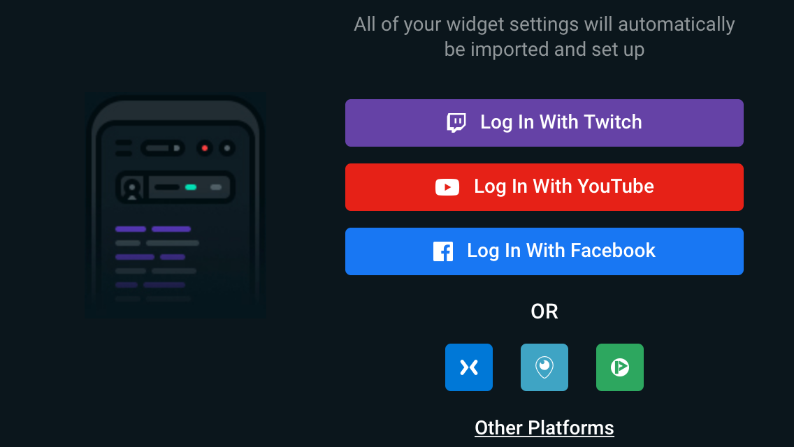

2. 填入工作人员给的“推流地址”和“密钥”；

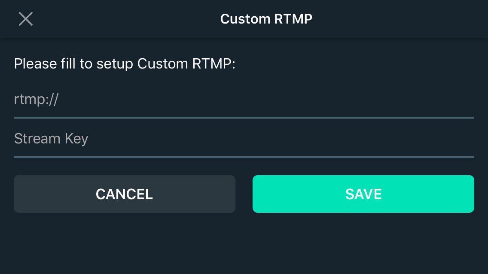

3. 分别点击 *ENABLE CAMERA* 和 *ENABLE MIC*，并同意调用摄像头和麦克风的权限；

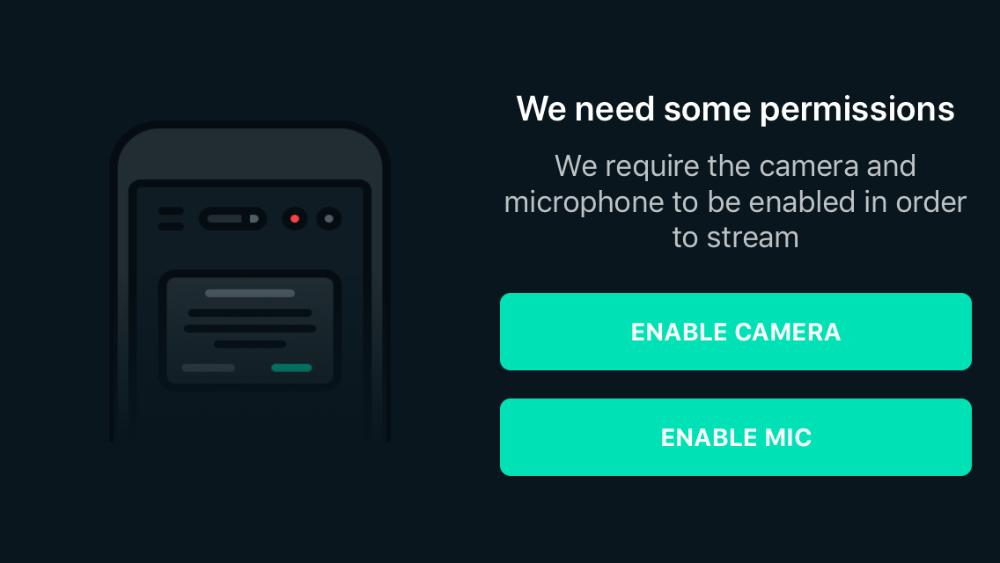

4. 这一步选择组建可以按照默认，直接点击 *NEXT*；

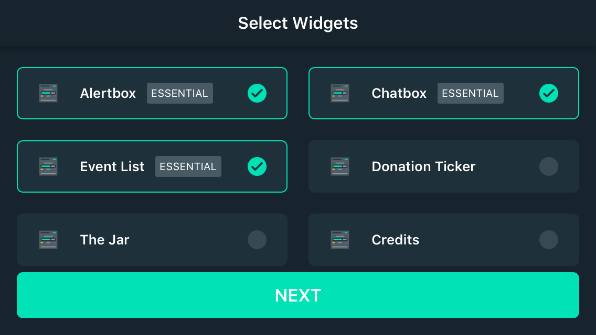

5. 设置完成，点击 *GET STARTED*；

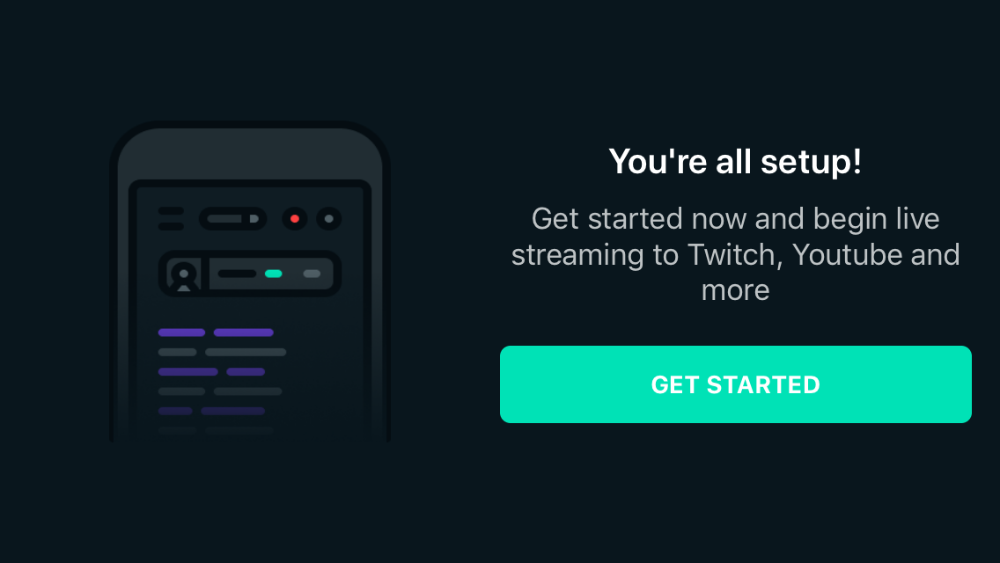

6. 现在来到了推流的主界面，屏幕的画面就是你当前正在使用的摄像头拍摄到的实时画面。左下角的两个按钮功能分别是 *切换前后摄像头* 和 *静音/打开声音* ，中间的红色按钮功能是 *开始推流/停止推流*。当工作人员给出开始表演的信号时，请点击红色的按钮开始推流，屏幕上方显示绿色信号表示以及当前画面帧率和网速，表示推流成功，表演结束后再次点击红色按钮，结束推流；

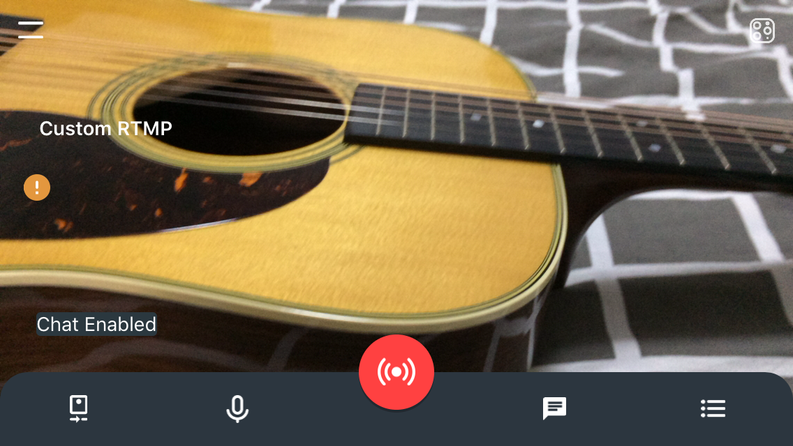

7. 如果出于某种原因，工作人员给您发送了新的推流地址和密钥，可以点击左上角的菜单按钮，然后在菜单中选择第一项 *Streaming Platform* 然后选择最后一项 *Custom RSMP Server* 并填入新的推流地址和密钥，保存即可。
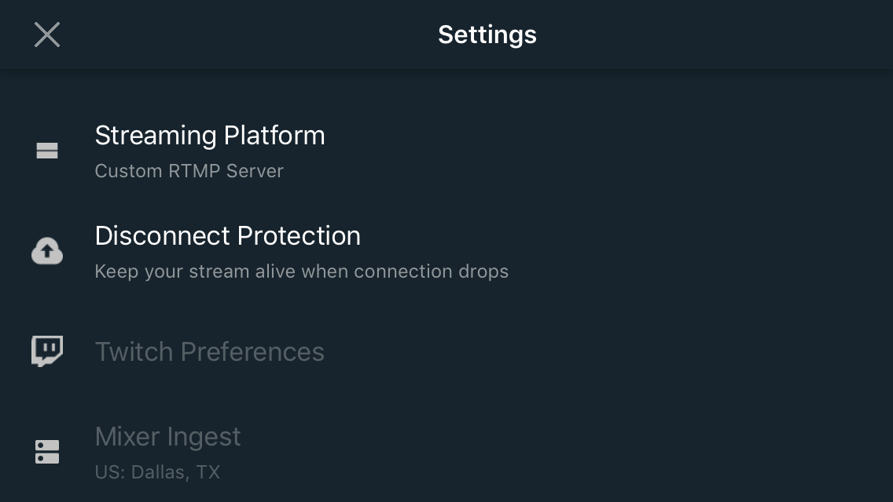

### 安卓手机
虽然我们在安卓系统也同样推荐[**Streamlabs**](https://play.google.com/store/apps/details?id=com.streamlabs)这款App，但是由于众所周知的原因，国内安卓用户可能会发现下载安装这款App有一定困难，所以此处我们以**芯象直播助手**为例介绍基本操作方法。如果您已经安装了安卓版Streamlabs，那么操作方法和iOS版本大同小异，如若遇到画面全黑，可以参照[这里](guide-for-performers?id=常见问题)解决。

请在手机的应用商店中搜索并安装**芯象直播助手**，因为各品牌应用商店内容不尽相同，如若搜索不到，可以尝试安装腾讯的*应用宝*，或自行去搜索引擎寻找官方的软件安装包（注意安全）。

1. 打开App，点击底下的 *本地导播*；

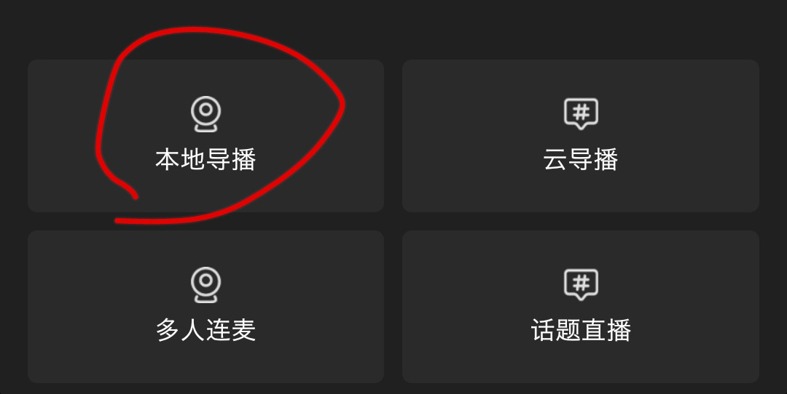

2. 无需注册登录，在底部弹出的选项中选择 *直接推流*；

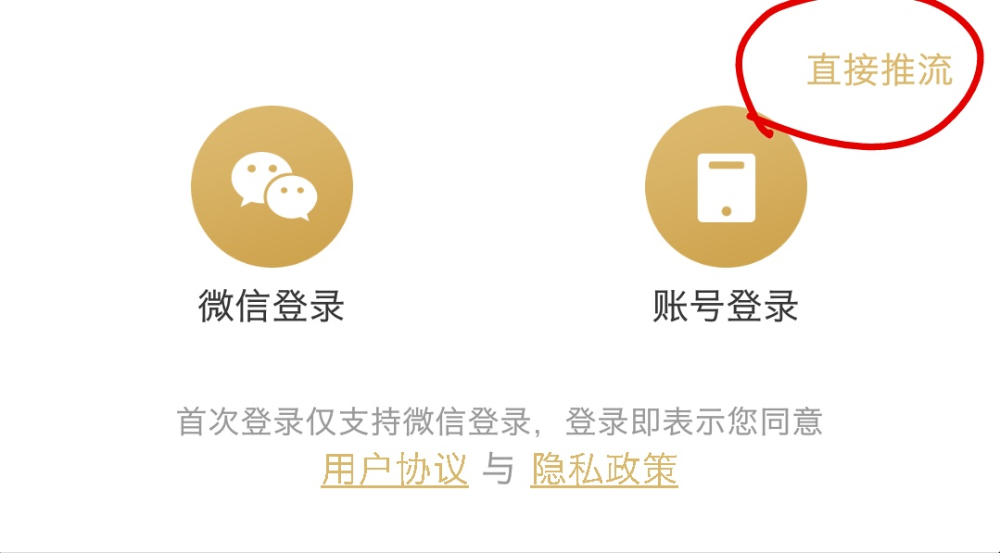

3. 在推流地址中填入工作人员提供的推流地址，注意这里如果工作人员给的是“推流地址”和“密钥”两部分，那么可以将其组合在一起填入，例如**假设**：

> 推流地址： rtmp://12.34.56.78/live
> 
> 密钥： performer009

那么此处应该填入：
> rtmp://12.34.56.78/live/performer009

其余参数保持默认即可（高清、横屏、30fps、高效），然后点击 *开始推流*；

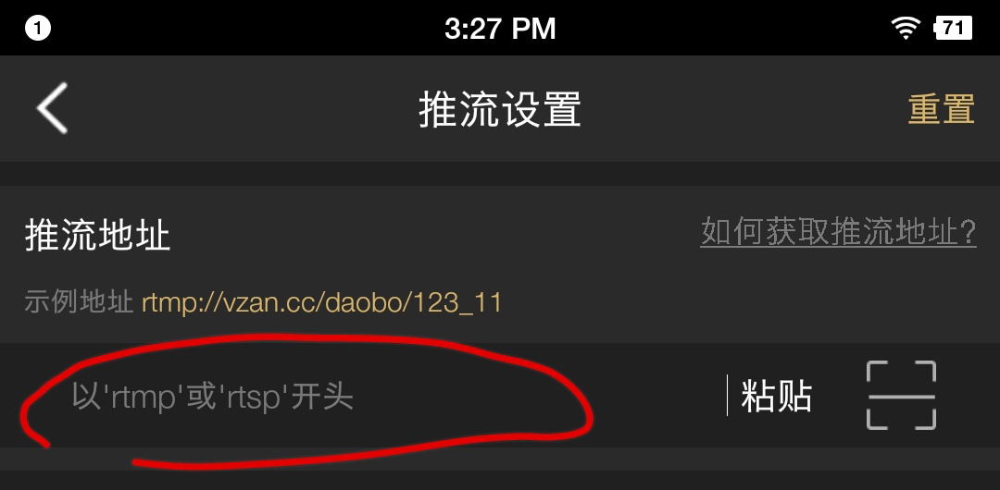

4. 现在显示的是直播推流的预览画面，点击左上角摄像头的设置按钮，然后可以选择反转镜头使用前置摄像头拍摄自己，调整好后，等待工作人员给出登台表演的指示，然后点击下方的 *开始直播* 按钮，即可开始推流。表演结束后，点击 *暂停推流* 然后退出程序即可。

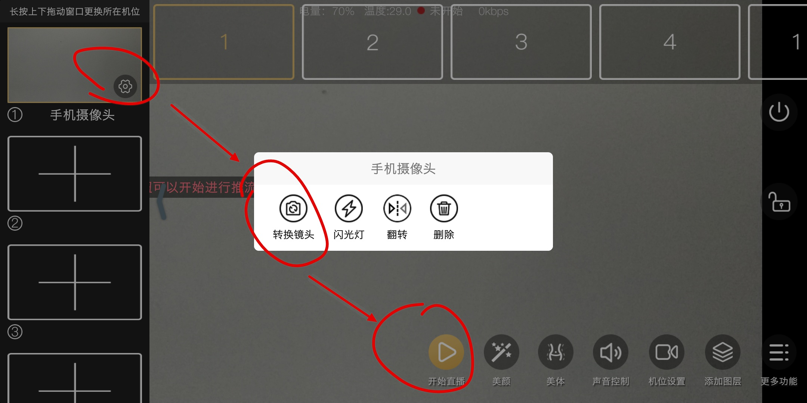

### 电脑
电脑端我们推荐使用[OBS Studio](https://obsproject.com)这款软件，他是一款开源的自由软件，支持Windows、MacOS和Linux系统。可以点击[这里](https://obsproject.com/download)免费下载。

## 注意事项

* 请在工作人员给出推流的指示后再开始推流，因为服务器承载能力有限，请勿在未登台演出是就开始推流，并且在表演结束后及时断开停止推流；

* 芯象直播助手的美颜功能似乎并不完善，如果手机配置较低，可能会出现画面明显的卡顿，所以不建议开启美颜；

## 常见问题
1. 为什么在安卓中使用Streamlabs推流，屏幕是全黑的？
> 可能是因为没有添加摄像机画面的相应图层。添加方法：

2. 我在表演的时候可以实时同步看到自己的直播画面和声音吗？
> 直播出去的画面和声音因为网络传输会有数秒的延迟，所以我们不建议表演的同时在旁边播放直播画面和声音，而且这样容易有回声进入你的演奏。推流软件会实时显示你当前摄像头的画面，就像当你自拍时一样，供参考调整镜头角度和自己的姿态。但是声音是没有返听的。

3. xxxxx
> yyyyy
