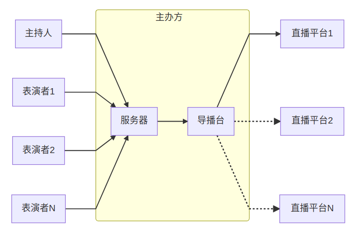
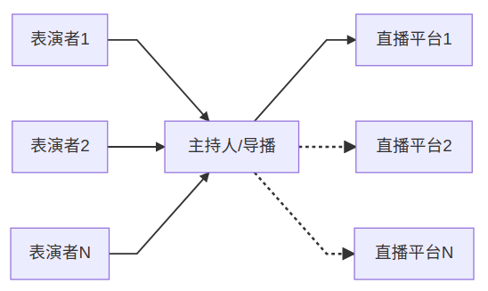

# 概览
因全球受到COVID19流行的影响仍未消除，此时举行大规模线下聚会并不合适。此前有 *One World: Together At Home* 和 *相信未来* 等线上音乐演出，反响不凡。我们受到启发，决定将草地音乐会也搬到线上，举行一场在线音乐聚会。

我们期待很快将可以一起重聚在草地上，但今后的日子里线上音乐会也并不是一个和线下互斥的替代方案，只要合适，线下和线上的聚会可以交替举办。

## 线上活动的体验水准

由于技术所限，多人同时在线合奏仍然会因网络延迟而无法同步，所以此前的线上音乐演出也或多或少采用了录播画面。但相比单纯的线上演出，草地音乐同样也非常在乎观众与表演者的实时互动，因而我们采用每次一人（或在同一地理位置的一组人）轮流在线表演并实时直播的形式，除非网络故障等特殊原因，不使用录播素材，尽力让活动获得与线下近似的体验。

## 活动流程
活动分为上下半场：曲目表演和自由分享。

首先主持人开场，上半场乐手按照事先报名的曲目和决定的顺序依次远程接入，每位乐手表演后断开，画面回到主持人，介绍下一位乐手，然后下一位乐手接入开始表演，如此往复。

下半场为自由分享阶段，具备接入条件（软硬件和网络）的音乐爱好者提前若干分钟发消息给工作人员进行登记排序，领取接入地址和口令，待主持人呼叫时接入表演。**自由分享阶段为设想，初次活动暂不实践。**

## 参与方法
### 观众
活动前主办方会公布本次活动使用的直播平台（如LOOK直播、bilibili等）和房间地址，用户直接访问相应直播平台的直播间即可观看。

### 表演者
表演者如果是初次参加活动，建议在活动前配合主办方进行网络排练，熟悉直播推流软件的使用以及测试网络环境的质量。

活动前，事先布置好场景，调试好设备和乐器。活动进行时，密切关注活动进度，在工作人员给出准备上台的信号后，使用推流软件开始推流，将画面和声音推送到主持人的服务器地址，等待主持人切换画面到表演者。

详细的说明部分，请参阅[表演者指南](guide-for-performers)部分。

## 如何举办
举办一场线上音乐会，主办方需要做好相关软件和服务器的部署，并且指定一名线上主持人进行主持。详细说明可以参阅[主办方指南](guide-for-hosts)。

## 技术原理
直播的本质是将摄像头和麦克风采集的声音画面传送出去，即推流。目前最主流的推流协议是RTMP协议，基本上各大直播平台也支持主播使用RTMP协议进行推流直播。与之相关的软件是推流软件和RTMP服务器，简单讲，前者负责推送而后者负责接收，推流软件在[表演者指南](guide-for-performers)部分有详细介绍，RTMP服务器采用Nginx引擎搭配RTMP模块，在大多数Linux服务器上可很方便地安装部署。

流媒体从推流软件传送到RTMP服务器，再被下一个推流软件从RTMP服务器中读取，接而推流到下一个RTMP服务器，这一环套一环理论上可以多次重复下去。所以抽象地看，在线草地音乐会的活动中，各个参与者按照推流的方向可以表示为下图：

即主办方架设一台服务器（参见[主办方指南](guide-for-hosts)），用于接收各个参与者推送来的流媒体，然后服务器根据导播台的需求，将画面发送给导播台，最后导播将合成的直播画面和声音推流到直播平台，理论上可以同时在多家平台进行直播，但可能会涉及到一些排他性政策的约束，以及每家平台的用户互动系统并不互通而带来的一些麻烦。另外，由于网络延迟的存在，多名表演者通常不会同时进行推流（合奏），而是按照表演顺序一个一个以此进行推流。

**一个更简化的方案如下**：

简化后，要求主持人、导播由同一人担任，并且主持人操作导播台所使用的电脑同时要充当流媒体接收的服务器，**本指南主要是以这个简化方案为例进行撰写**。当理解和熟悉后，可以发挥自己的想象，尝试更多可能的直播技术和方案。
